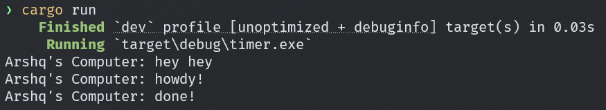
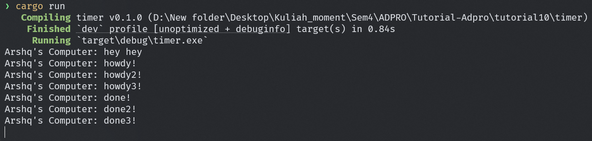

# Tutorial 10 - Timer

## 1.2 Understanding how it works

Setelah menambah print setelah Spawner.spawn di file main.rs, ketika dijalankan hasil print yang ada setelah spawner muncul pada terminal terlebih dahulu sebelum yang ada dalam spawner walaupun ditulis dibawahnya. Ini terjadi karena print tersebut berada diluar async block sehingga akan dieksekusi secara langsung dan sinkron, Baru setelah itu, executor.run() mulai memproses task-task yang sebelumnya dikirim oleh spawner.spawn(). Disana task async dijalankan dan baru print yang ada di dalam spawner.spawn(). 

## 1.3: Multiple Spawn and removing drop

Setelah menambah 2 spawner baru, hasil eksekusi muncul sesuai urutan spawnernya dari howdy -> howdy2 -> howdy3 lalu wait 2 detik untuk tiap output "done". Namun setelah itu, program tidak exit melainkan tetap jalan, ini karena penghapusan statement `drop(spawner)`. Ini menyebabkan program untuk tetap berjalan dan statement tersebut berfungsi untuk memberi tahu executor bahwa telah selesai dan tidak akan menerima task lagi kedepannya. Dengan demikian, tanpa statement yang drop spawner, program akan hang setelah selesai semua task, karena executor masih menunggu task baru. Dengan melakukan drop spawner executor tahu tidak ada task lagi yang akan masuk, sehingga keluar dari loop dan program selesai normal.